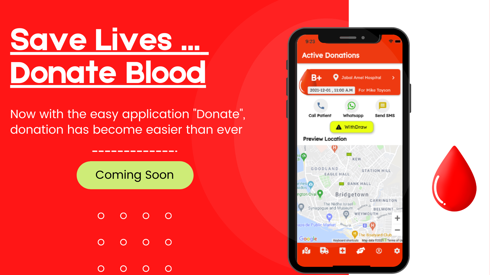

<!--
**YasserHaidar/YasserHaidar** is a ✨ _special_ ✨ repository because its `README.md` (this file) appears on your GitHub profile.

Here are some ideas to get you started:

- 🔭 I’m currently working on ...
- 🌱 I’m currently learning ...
- 👯 I’m looking to collaborate on ...
- 🤔 I’m looking for help with ...
- 💬 Ask me about ...
- 📫 How to reach me: ...
- 😄 Pronouns: ...
- ⚡ Fun fact: ...
-->
### Hi there 👋 , I am Yasser Haidar
 

 
  

<h4> ⚡ Part-Time software engineer specialized in designing and programming software systems using Flutter and PHP. Interested in leading programming teams in designing creative and advanced digital solutions.</h4>

<h4>Have strong passion for applying latest cybersecurity tools and techniques on software projects and systems.</h4>

###  🔭 TOP Software Projects:

<h3>1. Online Appointment System:</h3>
 
HexaPi Booking is a smart solution for the problem of long queues and time wasting. Add this platform to your business and organize the reservation of
appointments. The platform was designed in 2019 and was adopted officially by National Social Security Fund Office(Tyre Branch).
 
Technologies Used:
Flutter,PHP,Cloud Firestore, Cloud Messaging, Firebase Authentication, Cloud Automated Functions,Google Cloud Console,AppStore Configuration, Analytics and Crashlytics, ...
 
Read More in this <a href="https://hexapi.tech/booking.html" target="_blank">Brochure</a>.
 
<a href="https://play.google.com/store/apps/details?hl=en_US&id=com.techno.nssf" target="_blank">Play Store User Application</a>

<a href="https://apps.apple.com/us/app/id1509406107" target="_blank">App Store User Application</a>
 
  
<h3>2. Smart School Platform:</h3>
 
Smart School is an interactive friendly platform for facilitating the online learning process for all students who have faced difficulties in following up
their classes remotely. It was designed and developed in 2020 for my startup comapany <a href="https://hexapi.tech" target="_blank" >HexaPi Tech</a>.
 
Technologies Used:
Flutter for Mobile and Web,PHP,Javascript, C# for WebServices,Cloud Firestore, Cloud Messaging, Agora Live Video SDK, Cloud Automated Functions,Google Cloud Console,...
 
Read More in this <a href="https://hexapi.tech/school.html" target="_blank">Brochure</a>.
 
<a href="https://play.google.com/store/apps/details?hl=en_US&id=com.techno.eschool" target="_blank">Play Store User Application</a>
   

<h3>3. Delivery Management & Tracking System:</h3>
 
HexaPi Delivery is a management system for Delivery companies to help them organize their seller's orders, their accounting settlements and their drivers' tracking process. 
 
Technologies Used:
PHP,Javascript,MySQL Database,Flutter for Mobile,Cloud Messaging,..
   
Read More in this <a href="https://hexapi.tech/HexaPi%20Delivery%20Brochure.pdf" target="_blank">Brochure</a>.
 
<a href="https://hexapi.tech/delivery" target="_blank">Admin Dashboard (admin/admin)</a> 
<a href="https://play.google.com/store/apps/details?id=com.hexapi.delivery_driver" target="_blank">Play Store Driver Application(rider4/rider4)</a>

   
<h3>4. Blood Donation Platform (Working on):</h3>
 
 This mobile application is planned to enhance the process of requesting blood plaquets for the patients and make it as fast as possible by implementing personalized and selective push notifications and messages for the target donors. I am aiming with some investors for promoting this app for a large portion of Lebanese people.
 Technologies Used:
Flutter,PHP,Javascript,MySQL Database,Firebase Authentication,Cloud Messaging,Google Maps Integration,...
  
 Stay Tuned for this free and great platform...
 
### ML/DL Thesis Research:

In recent years, malware development for Android mobiles has increased dramatically and Google is trying daily to limit or stop this threat on its operating system. However, not only Google is developing new techniques for detecting malicious applications, but also, malware developers are updating their techniques regularly in order to hide their malware from detection systems.

In my Master thesis, I have introduced an advanced technique for android malware detection using machine learning and deep learning techniques. A modern and big dataset is constructed and four different models are tested on this dataset and other applications. The best performance was recorded by CNN model where it reaches 99.0% on testing set and 80% on 2021 malware dataset and with short detection time.

You can find the Online Hosted Model on:
<a href="https://andromalware-dbf.herokuapp.com/" target="_blank">Deep Belief Network</a>

### Languages & Frameworks:

 
     
    
 
  
  </a>  </a> 
  
   
  
    
      

 

### 📫 Reach Me on:

